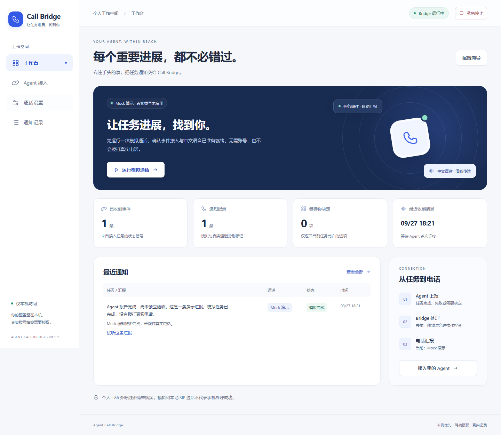

# Agent Call Bridge

让 Codex / AI Agent 在任务完成、失败、受阻或需要决定时，把消息送到中文通话工作台，并通过可用电话线路联系本人或已同意接听的人。

**Windows 优先 · 中文界面 · 本机配置 · 默认 Mock · 开源 MIT**



v0.1.1 更新界面：雾白与海军蓝配色、更清晰的字号和状态、移动底部导航及卡片式通知记录。电话能力与授权边界保持不变。

> **个人 +86 手机外呼线路尚未落实。** Twilio 不支持中国大陆外呼；阿里云需符合条件的企业、语音资质及模板审核。填写 Key 或手机号不保证能拨通。Mock、本地中文语音、软件 SIP 通话都不等于手机外呼成功。本项目不用于批量营销。

## 快速开始

普通用户：从 [Releases](https://github.com/dujiahang-du/agent-call-bridge/releases) 下载 Windows x64 ZIP，解压到可写目录，双击 **Start.cmd**。随包提供固定版本 Node 与生产依赖，无需 npm、编译器或管理员权限。

默认地址为 `http://127.0.0.1:17860`。请通过启动器打开已认证页面；管理界面不向局域网公开。

1. 向导选择 Mock，手机与凭据可以留空。
2. 生成中文试听、运行一次模拟通话。
3. 在“Agent 接入”中接入当前项目，由实际 Codex 任务上报验证。
4. 需要真实通话时按[统一补齐清单](docs/USER_GUIDE.md)核实线路、权限、费用和回调，并单独明确授权。

源码方式（Node 22.18+ 或 Node 24）：

```powershell
npm ci
npm run build
.\Start.cmd
```

## 当前能力

| 能力 | v0.1 状态 |
| --- | --- |
| 中文向导、配置保存、线路检测、语音试听、记录、紧急停止 | 已实现；浏览器实际操作测试 |
| 现有 Codex 桌面任务 → Bridge → Mock | 已用真实子任务验证，不是固定事件脚本 |
| 回复返回仍在等待的原桌面任务 | 已验证；选择后同一任务继续生成实际校验产物 |
| 唤醒已结束的桌面任务 | 不支持；不会接管桌面私有数据库 |
| MCP stdio / 项目说明接入 | 已实现；运行中桌面的 MCP 热加载不作保证 |
| 产品托管 Codex | 有隔离环境协议适配，已真实握手；无完整托管任务界面，未运行真实模型验收 |
| Twilio 非 +86 中文通知与按键控制 | 官方 SDK 与签名回调已实现，契约测试；等待真实账号、线路与授权后实测 |
| 阿里云企业 +86 模板通知 | 官方 SDK、签名请求与结果轮询已实现，契约测试；资质/模板/运营商尚未实测 |
| SIP 中文通话、注册、音频、按键、挂断 | 已验证本地原生软件端点；UDP/TCP 实验性，无 TLS/SRTP；按键未接入任务控制 |
| ATA/传统模拟话机 | 提供配置与实机测试清单，未实测；FXS 不会自动提供运营商外线 |

详细证据与未覆盖项见[验收记录](docs/VALIDATION.md)。本版本为能力边界明确的预发布版，不保证任何国家/地区或电话商的线路可开通。

## 接入方式

现有 Codex 不必切换工作流。安装器合并可撤销的项目说明，Agent 通过已有终端调用随包 `Bridge.cmd`，自动绑定真实任务标识。`report-and-wait` 将问题及允许选项送到工作台，在原任务仍等待时返回结构化回复。CLI、HTTP 和 MCP 共用后端逻辑。

轮次结束只是轮次结束。界面和播报区分“Agent 报告完成”与已提供的验收证据；外部声明不冒充独立验收。疑似停滞监控仅对显式登记心跳的活动任务启用，不能检测所有未接入任务的崩溃。

## 安全与费用

- 默认模拟；保存配置不会拨号。首次真实电话需明确授权，自动通知也需独立启用。
- 同时最多一通；默认间隔五分钟、每小时三通、每日十通；事件持久化去重。受理状态未知不重拨。
- 回调入口与管理界面分离；电话回复验签、PIN、任务绑定、允许选项、有效期和一次消费。
- 电话不会批准系统权限或执行任意命令；“停止任务”不意味着所有后台程序均已终止。
- Windows 凭据由 DPAPI 绑定当前用户；换电脑重新填写、登录和授权。不要复制运行数据库或认证到公开仓库。
- 外部服务可能收费；真实拨号前必须由本人核实。阿里云通知一旦受理可能无法中途取消。

安全边界见 [SECURITY.md](SECURITY.md)，第三方许可见 [THIRD_PARTY_NOTICES.md](THIRD_PARTY_NOTICES.md)。

## 开发与验证

```powershell
npm run typecheck
npm test
npm run build
npm run test:ui
```

SIP 原生测试需要固定构建，参见 [SIP 文档](docs/sip.md)。没有原生程序时会明确标记未执行，不算通过。界面测试默认使用本机 Edge。所有测试默认本地模拟，不调用真实云电话或模型。

调研来源和选型见 [findings.md](findings.md)。开发采用安全检查点提交；没有安装永久定时备份任务，不承诺会话结束后自动开发。恢复开发先读源码仓库中的 `task_plan.md` 和 `progress.md`。
